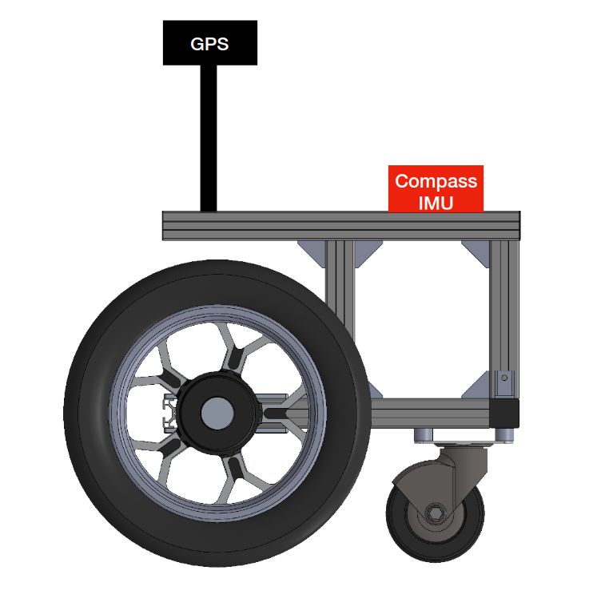
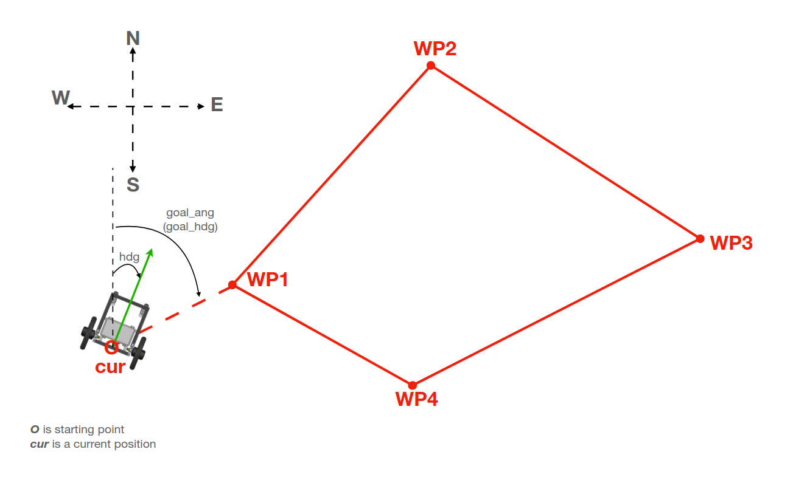
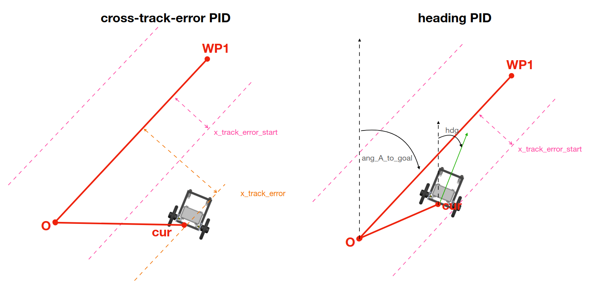
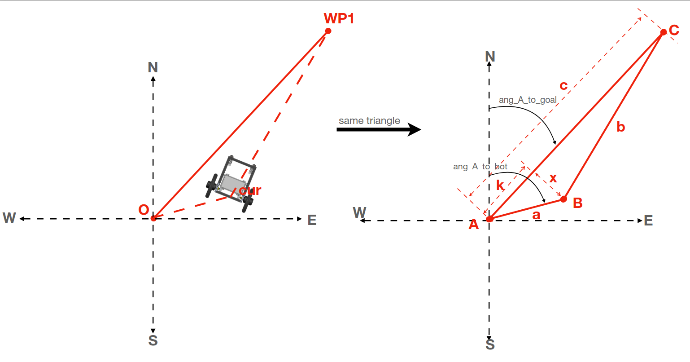
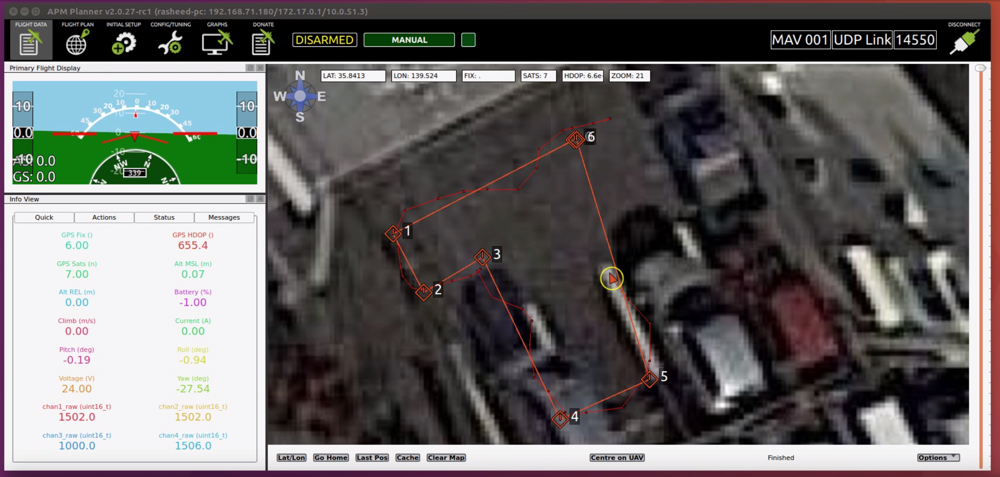

# JMOAB_Autopilot_ROS

This is an autonomous drive package for rover with jmoab-ros, please check [jmoab-ros repo here](https://github.com/rasheeddo/jmoab-ros).

This package is designed to work side by side with jmoab-ros package to provide a feature of autonomous drive in many applications.

It could run with the real actual robot with JMOAB and also in simulation world in Gazebo as Software In The Loop (SITL).

Currently, it supports an autonomous drive as following.

- GPS Waypoints Navigation

## GPS Waypoints Navigation

### Hardware

To run autonomous drive outdoor with GPS envioronment, you will need

- Ublox F9P GPS with a [setup here](https://github.com/rasheeddo/jmoab-ros#jmoab-with-f9p-gps)

- BNO055 9-axes orieintation sensor with a [setup here](https://github.com/rasheeddo/jmoab-ros#run-as-compass-mode)

and you need to GPS as close to the wheel base axis, or pivot point when turning, and Compass/IMU on the middle of the cart.

### Algorithms

You can check on `nodes/gps_waypoints_navigation.py` for the code, I will explain roughly how does it work..

So first you will need a waypoints file as shown in `waypoints/mission.txt` for example. The format is same as Ardupilot as QGC WPL 110. So you can make the mission file from APM Planner and click on Save WP. I found that MAVLink has some issue of lat/lon decimal points, it's not accurate when transfer using MAVLink command, so I don't recommend to use "Write" or "Read" button on GCS.

Once the bot has waypoints file it will store on as array of `lat_target_list[], lon_targe_list[]`, then we gonna iterate with `target_wp` index counter to go to next watpoint. There are 5 step to make the bot go from current point to target waypoint.

1. Get the smallest angle to turn, and direction to turn.

2. Turn with constant sbus_steering speed, until it reahced the angke within threshold.

3. Get the distance how far it should go

4. Keep going to that point by using PID cross-track and heading controllers, if the bot is inside threshold of `x_track_error_start` then it will use PID heading, but if bot goes out of that threshold it will use PID cross-track. To calculate a related angle and distance variable, please check on two following images.

5. Once the bot reached the target waypoint within `goal_dist_thresh` threshold, it will iterate to next point and start with the step1 again.

Finally, if the robot can achieve all the point successfully, then it will just finish the mission and wait for user to switch back to auto mode again, as step 6.

### Run

- On the bot 

	- You will need to run gps, atcart, compass, RTK nodes as explained from jmoab-ros doc. 

	- On this package you will need to run `rosrun jmoab_autopilot_ros gps_waypoints_server.py` to start the parameters server. This is need when you firstly want to tune up the bot.

	- And on `jmoab_autopilot/nodes` you need to run a navigation script as `python gps_waypoints_navigation.py`, you can copy this script to your project directory and make some modification according to what you need.

- On the PC

	- Then you can run `rosrun rqt_reconfigure rqt_reconfigure` on you PC for GUI adjuster.

### Parameters

We are using `ros_dynamic_reconfigure`, so we can adjust the paramters lively from `rqt_reconfigure` GUI. Once you open it up it's like this,

The paramters in here are same as `cfg/GpsWaypoints.yaml`, so once you satisfied with tuning, you will need to update it manually on the bot on this file too (I will find the way for automate this later).

#### Steering

- max_start_str: 1054, this is a maximum sbus steering to make the cart start to turn right, each cart has different value depends on load

- min_start_str: 986, this is a minimum sbus steering to make the cart start to turn left, each cart has different value depends on load

- str_adj: 100, this is an adjuster sbus value to use with output PID mapping, so max output pid will use this full range +/- max/min_start_str

- skid_adj: 80, this is a pivot turn adjuster sbus value, so it will be +/- on max/min_start_str for right/left pivot-turning

- str_mid: 969

#### Throttle

- max_start_thr: 1080, this is a maximum sbus throttle to make the cart start to move forward.

- thr_adj: 100, this is an adjuster sbus value to + on max_start_thr, to use as constant speed during navigation.

- thr_slowest: 1140, this is the slowest sbus throttle in case of short distance navigation, we don't want the bot to move too fast when short range.

- thr_mid: 1024, a middle sbus throttle, no need to change this.

#### General Judgement Threshold

- goal_dist_thresh: 0.2, this is a radius of waypoints, it means if the cart is closed to target waypoint within this radius, it's considered as reached the point.

- goal_ang_thresh: 1.0, this is a threshold angle when cart is turning as pivot, so if difference between goal target angle and current angle is under this, it's considered as arrival at goal target angle.

- x_track_error_start: 0.12, this is a cross-track distance from the route to make the PID cross-track controller starts, when x_track_error less than this, the cart will use PID heading controller instead.

- x_track_repose_dist: 0.40, this is the maximum cross-track distance that tell the cart is too far from the route and it will start re-target heading again.

- pid_hdg_out_thresh: 0.7, if `diff_hdg` is less than this, it won't use PID heading and just keep driving straight.

- pid_x_out_thresh: 0.1, if `x_track_error` is less than this, it won't use PID cross-track, it's better to make it same as x_track_error_start or not higher.

#### PID gain

- hdg_p: 40.0, P gain of heading control

- hdg_i: 0.0, I gain of heading control

- hdg_d: 0.0, D gain of heading control

- cross_p: 150.0, P gain of cross-track control

- cross_i: 10.0, I gain of cross-track control

- cross_d: 0.0, D gain of cross-track control

### Tips

- If the heading is not good, the bot will move like snake and has a hard time to go back to the route, so please calibrate the heading offset again [see here](https://github.com/rasheeddo/jmoab-ros/blob/master/example/compass_calibration_step.md).

